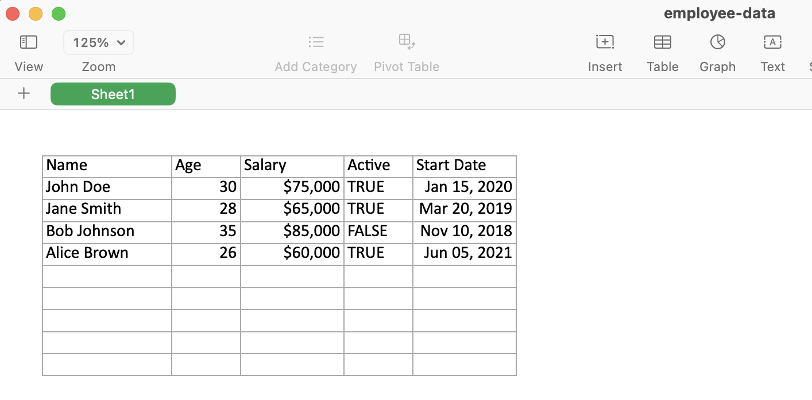

# react-export-sheetjs

A React component that allows you to define Excel sheets using JSX and export them using SheetJS.

## Features

- Define spreadsheets using familiar JSX syntax
- Support for different cell types (text, number, boolean, date, formula)
- Formula support with relative cell references using the `rc()` function
- Custom formatting and column widths -- no more truncated columns or numbers interpreted as dates!
- Convert to SheetJS format for export into any format supported by SheetJS (including Excel)

## Usage

### Installation

```
npm install react-export-sheetjs
```

### Demo

https://xkjyeah.github.io/react-excel-export/

### Basic Example

```tsx
import React, { useRef } from 'react';
import { SheetJsOutput, SheetJsOutputRef, rc } from 'react-export-sheetjs';
import * as XLSX from 'xlsx';

const MyComponent: React.FC = () => {
  const sheetRef = useRef<SheetJsOutputRef>(null);

  return (
    <div>
      <SheetJsOutput ref={sheetRef}>
        <row widthSetting={true}>
          <text width={15}>Name</text>
          <text width={8}>Age</text>
          <text width={12}>Salary</text>
          <text width={12}>Monthly salary</text>
          <text width={8}>Active</text>
          <text width={12}>Start Date</text>
        </row>

        <row>
          <text>John Doe</text>
          <number>30</number>
          <number z="$#,##0">75000</number>
          <formula z="$#,##0">{rc(0, -1)} / 12</formula>
          <boolean>true</boolean>
          <date z="MMM dd, yyyy">2020-01-15</date>
        </row>

        <row>
          <text>Jane Smith</text>
          <number>28</number>
          <number z="$#,##0">65000</number>
          <formula z="$#,##0">{rc(0, -1)} / 12</formula>
          <boolean>true</boolean>
          <date z="MMM dd, yyyy">2019-03-20</date>
        </row>

        <row>
          <text>Bob Johnson</text>
          <number>35</number>
          <number z="$#,##0">85000</number>
          <formula z="$#,##0">{rc(0, -1)} / 12</formula>
          <boolean>false</boolean>
          <date z="MMM dd, yyyy">2018-11-10</date>
        </row>
      </SheetJsOutput>

      <button onClick={downloadExcel(sheetRef.current)}>Download as Excel</button>
    </div>
  );
};

const downloadExcel = async sheetJsOutput => {
  const worksheet = await sheetJsOutput.getSheet();
  const workbook = {
    SheetNames: ['Sheet1'],
    Sheets: { Sheet1: worksheet },
  };

  const fileData = XLSX.writeXLSX(workbook, {
    bookType: 'xlsx',
    type: 'buffer',
  });

  const blob = new Blob([fileData], {
    type: 'application/vnd.openxmlformats-officedocument.spreadsheetml.sheet',
  });

  const url = URL.createObjectURL(blob);
  const a = document.createElement('a');
  a.href = url;
  a.download = 'employee-data.xlsx';
  a.click();
};
```

Result:


## Trying it out

The demo website is hosted in `examples/`.

### Running the Example

```bash
cd examples
npm install
npm run dev
```

Visit `http://localhost:3000` to see the demo in action.

### Cell Types

The component supports the following cell types:

- `<text>` - Text values
- `<number>` - Numeric values
- `<boolean>` - Boolean values
- `<date>` - Date values
- `<formula>` - Excel formulas

### Cell Properties

Each cell type supports the following properties:

- `width?: number` - Column width
- `z?: string` - Excel format string
- `children` - The cell value

### Row Properties

Rows support the following properties:

- `widthSetting?: boolean` - Whether this row defines column widths

### Using the Ref

The `SheetJsOutput` component exposes a ref with a `getSheet()` function that returns the current sheet data as a [SheetJS Sheet Object](https://docs.sheetjs.com/docs/csf/sheet):

```tsx
const excelSheet = await sheetRef.current.getSheet();
```

## API Documentation

### `<SheetJsOutput>`

The main component that renders Excel data.

**Props:**

- `children` - Excel structure using the cell components

### `<row>`

Represents an Excel row.

**Props:**

- `widthSetting?: boolean` - If true, this row's cell widths will be used to set column widths
- `children` - Cell components

### Cell Components

#### `<text>`

Renders a text cell.

**Props:**

- `width?: number` - Column width (only appliable in a `widthSetting` row)
- `z?: string` - Format string
- `children` - Cell content

#### `<number>`

Renders a numeric cell.

**Props:**

- `width?: number` - Column width (only appliable in a `widthSetting` row)
- `z?: string` - Format string (e.g., "#,##0.00")
- `children` - Cell content

#### `<date>`

Renders a date cell.

**Props:**

- `width?: number` - Column width (only appliable in a `widthSetting` row)
- `z?: string` - Date format (e.g., "MMM DD", "YYYY-MM-DD")
- `children` - Date value

#### `<boolean>`

Renders a boolean cell.

**Props:**

- `width?: number` - Column width (only appliable in a `widthSetting` row)
- `z?: string` - Format string
- `children` - Boolean value

#### `<formula>`

Renders a formula cell.

**Props:**

- `width?: number` - Column width (only appliable in a `widthSetting` row)
- `z?: string` - Format string
- `children` - Excel formula

### Formula Support

The library supports Excel formulas with relative cell references using the `rc()` function:

```tsx
import { rc } from 'react-export-sheetjs';

// Formula that divides the cell to the left by 12
<formula z="$#,##0">{rc(0, -1)} / 12</formula>;
```

#### `rc(dr, dc)`

Creates a relative cell reference for use in formulas.

**Parameters:**

- `dr: number` - Delta row (row offset relative to current cell)
- `dc: number` - Delta column (column offset relative to current cell)

**Examples:**

- `rc(0, -1)` - References the cell to the left
- `rc(-1, 0)` - References the cell above
- `rc(0, -2)` - References the cell two columns to the left
- `rc(1, 1)` - References the cell one row down and one column right

The `rc()` function generates the appropriate Excel cell reference (e.g., A1, B2) based on the current cell position during rendering.

## How It Works

This library uses React's custom renderer (react-reconciler) to create a virtual representation of Excel data. Instead of rendering to the DOM, it renders to a custom data structure that can be converted to SheetJS format.

The key components (`row`, `text`, `number`, etc.) are not actual DOM elements but custom elements that the renderer understands and processes to build the Excel structure.

## License

MIT
